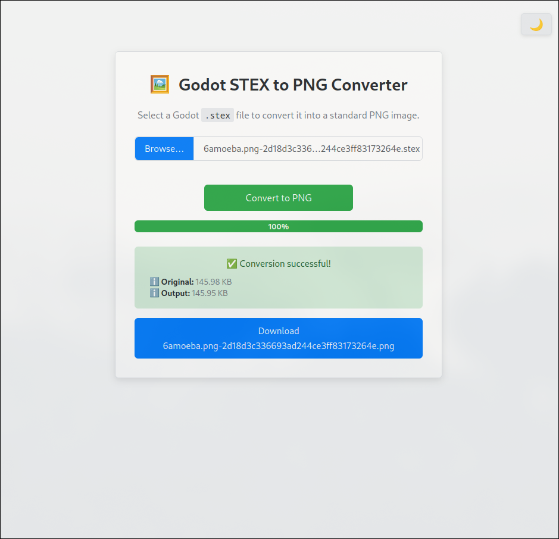
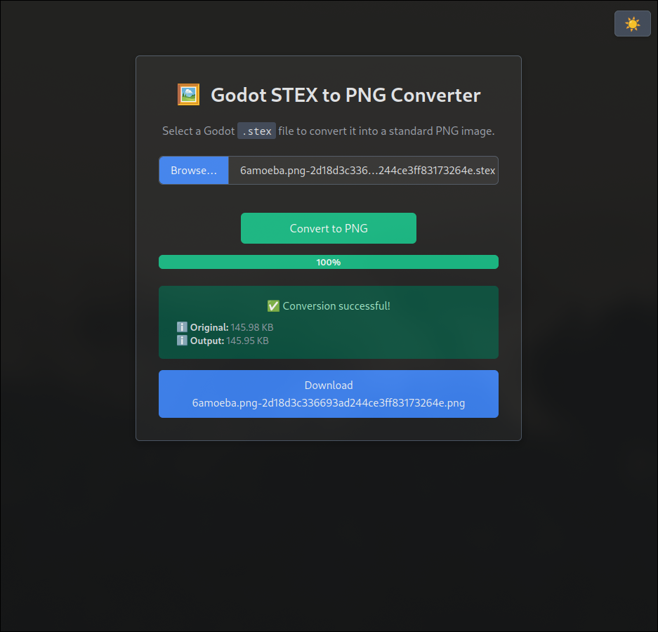

# 🖼️ Godot STEX to PNG Converter (Website)

A simple, client-side web tool to convert Godot Engine's `.stex` (StreamTexture2D) files into standard `.png` images directly in your browser.

<!--  --> <!-- Optional: Add a screenshot link -->




## Features

*   **Client-Side Conversion:** Files are processed directly in your browser using JavaScript. No server upload is required, ensuring privacy and speed.
*   **Easy to Use:** Simple file selection and conversion process.
*   **Progress Indicator:** Visual feedback during the conversion.
*   **Direct Download:** Get a download link for the generated PNG file.
*   **Light/Dark Mode:** Adapts to your system's theme preference or allows manual toggling.
*   **No Installation:** Runs entirely in a modern web browser.

## What is `.stex`?

`.stex` files are Godot Engine's internal format for storing imported texture data (StreamTexture2D). They often contain compressed or optimized image data specific to Godot's rendering pipeline. This tool aims to decode that data back into a universally viewable PNG format.

**Note:** The actual STEX parsing and PNG encoding logic needs to be implemented in the `script.js` file. This repository currently provides the user interface (HTML/CSS) and the basic JavaScript structure for handling file input, UI updates, and theme toggling. The core conversion functionality itself is **not yet implemented** in the provided code snippets.

## How to Use (Live Demo)

The easiest way to use the converter is via the live version hosted on GitHub Pages:

**➡️ Live Demo: [https://YOUR_USERNAME.github.io/YOUR_REPOSITORY_NAME/](https://YOUR_USERNAME.github.io/YOUR_REPOSITORY_NAME/)**

*(Replace `YOUR_USERNAME` and `YOUR_REPOSITORY_NAME` with your actual GitHub username and the name of this repository)*

**Steps:**

1.  **Open the Live Demo Link:** Navigate to the URL above in your web browser.
2.  **Select File:**
    *   Click the "Choose file..." button (or the area next to it).
    *   Select the `.stex` file you want to convert from your computer.
3.  **Convert:** Click the "Convert to PNG" button.
4.  **Wait:** The progress bar will show the conversion status. Status messages will provide feedback (e.g., "Processing...", "Success!", "Error...").
5.  **Download:** If the conversion is successful, a "Download PNG" link will appear below the status message. Click this link to save the generated `.png` file.

## Technical Notes & Limitations

*   **Client-Side Processing:** All conversion happens within your browser. Larger files might consume significant memory or time depending on your device.
*   **Browser Compatibility:** Requires a modern web browser that supports HTML5 File API, Web Workers (if used for heavy processing), Canvas API, and ES6 JavaScript.
*   **STEX Format Support:** The specific STEX formats (e.g., compression types like S3TC, ETC, BPTC, uncompressed formats like RGBA8) supported will depend entirely on the implementation within `script.js`. **(Currently requires implementation)**.
*   **Error Handling:** Basic error messages are displayed, but complex STEX format issues might require developer investigation.

## Running Locally (for Development)

If you want to run the tool locally or contribute to its development:

1.  **Clone the repository:**
    ```bash
    git clone https://github.com/YOUR_USERNAME/YOUR_REPOSITORY_NAME.git
    cd YOUR_REPOSITORY_NAME
    ```
2.  **Open `index.html`:** You can often open the `index.html` file directly in your browser.
3.  **Use a Local Server (Recommended):** For full functionality and to avoid potential browser security restrictions (especially related to file handling or future use of Web Workers), it's better to use a simple local web server.
    *   **If you have Python 3:**
        ```bash
        python -m http.server
        ```
        Then open `http://localhost:8000` in your browser.
    *   **If you have Node.js:** Install `live-server` globally (`npm install -g live-server`) and run:
        ```bash
        live-server
        ```
        It will automatically open the page in your browser.

## Contributing

Contributions are welcome! If you find a bug, have suggestions, or want to help implement the core STEX parsing logic:

1.  **Fork** the repository.
2.  Create a new **branch** (`git checkout -b feature/your-feature-name`).
3.  Make your changes and **commit** them (`git commit -am 'Add some feature'`).
4.  **Push** to the branch (`git push origin feature/your-feature-name`).
5.  Open a **Pull Request**.

Please report any issues using the GitHub Issues tab.

---

**Remember to:**

1.  Replace `YOUR_USERNAME` and `YOUR_REPOSITORY_NAME` in the links with your actual details.
2.  Consider adding a screenshot of the tool in action and uncomment/update the screenshot link.
3.  **Crucially:** Implement the actual STEX parsing and PNG conversion logic in `script.js` for the tool to be functional.
